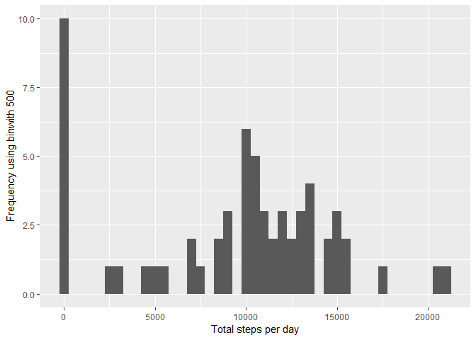
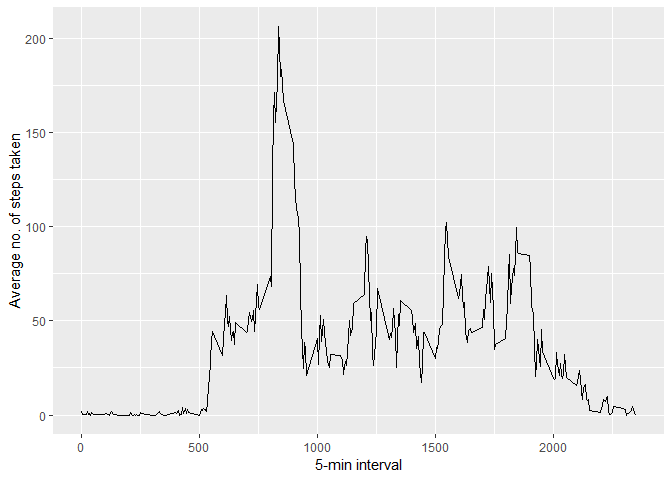
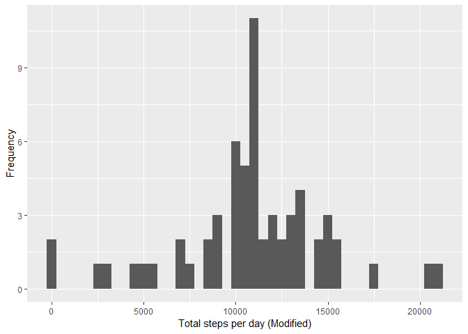
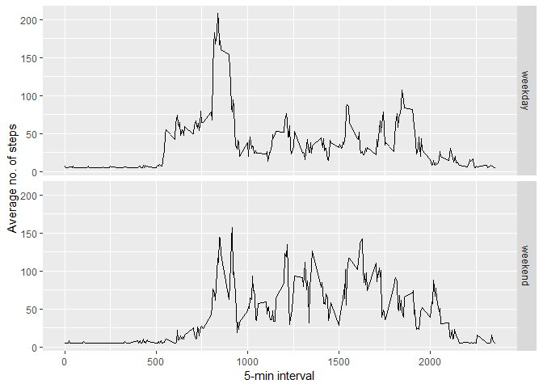

## Loading and preprocessing the data

##### 1. Load the data (i.e. read.csv())

```r
if(!file.exists('activity.csv')){
    unzip('activity.zip')
}
data <- read.csv('activity.csv')
```
##### 2. Process/transform the data (if necessary) into a format suitable for your analysis

```r
#data$interval <- strptime(gsub("([0-9]{1,2})([0-9]{2})", "\\1:\\2", data$interval), format='%H:%M')
```

-----

## What is mean total number of steps taken per day?

##### 1. Calculate the total number of steps taken per day

```r
stepsTakenDay <- tapply(data$steps, data$date, sum, na.rm=TRUE)
```

##### 2. Make a histogram of the total number of steps taken each day

```r
qplot(stepsTakenDay, xlab='Total steps per day', ylab='Frequency using binwith 500', binwidth=500)
```

<!-- -->

##### 3. Calculate and report the mean and median total number of steps taken per day

```r
stepsTakenDayMean <- mean(stepsTakenDay)
stepsTakenDayMedian <- median(stepsTakenDay)
```
* Mean: 9354.2295082
* Median:  10395

-----

## What is the average daily activity pattern?


```r
averageSteps <- aggregate(x=list(meanSteps=data$steps), by=list(interval=data$interval), FUN=mean, na.rm=TRUE)
```

##### 1. Make a time series plot of the 5-min interval (x-axis) and the average number of steps taken, averaged across all days (y-axis)

```r
ggplot(data=averageSteps, aes(x=interval, y=meanSteps)) +
    geom_line() +
    xlab("5-min interval") +
    ylab("Average no. of steps taken") 
```

<!-- -->

##### 2. Which 5-minute interval, on average across all the days in the dataset, contains the maximum number of steps?

```r
maxSteps <- which.max(averageSteps$meanSteps)
maxSteps_Time <-  gsub("([0-9]{1,2})([0-9]{2})", "\\1:\\2", averageSteps[maxSteps,'interval'])
```

* Maximum number of steps at: 8:35

----

## Imputing missing values

##### 1. Calculate and report the total number of missing values in the dataset 

```r
numNA <- length(which(is.na(data$steps)))
```

* Number of missing values are : 2304

##### 2. Devise a strategy for filling in all of the missing values in the dataset.

```r
data_mod <- data
```
##### 3. Create a new dataset that is equal to the original dataset but with the missing data filled in.

```r
data_mod$steps <- impute(data$steps, fun=mean)
```

##### 4. Make a histogram of the total number of steps taken each day and calculate and report the mean and median total number of steps taken per day. 

```r
stepsTakenDay_mod <- tapply(data_mod$steps, data_mod$date, sum)
qplot(stepsTakenDay_mod, xlab='Total steps per day (Modified)', ylab='Frequency', binwidth=500)
```

<!-- -->

```r
stepsTakenDayMean_mod <- mean(stepsTakenDay_mod)
stepsTakenDayMedian_mod <- median(stepsTakenDay_mod)
```
* Mean is: 1.0766189\times 10^{4}
* Median is:  1.0766189\times 10^{4}

##### 5. Do these values differ from the estimates from the first part of the assignment? 

##### Origin
* Mean: 9354.2295082
* Median:  10395

##### After Impute
* Mean is: 1.0766189\times 10^{4}
* Median is:  1.0766189\times 10^{4}

###### It can be seem that both of the values differ slightly.

##### 6. What is the impact of imputing missing data on the estimates of the total daily number of steps? 

###### It seems that the impact of imputing missing values has increase our peak, but it's not affect negatively our predictions.

----

## Are there differences in activity patterns between weekdays and weekends?

##### 1. Create a new factor variable in the dataset with two levels - "weekday" and "weekend" indicating whether a given date is a weekday or weekend day.


```r
data_mod$dateType <-  ifelse(as.POSIXlt(data_mod$date)$wday %in% c(0,6), 'weekend', 'weekday')
```

##### 2. Make a panel plot containing a time series plot of the 50min interval(x-axis) and the average nomber of steps taken, averaged across all weekdays days or weekend days (y-axis).


```r
averaged <- aggregate(steps ~ interval + dateType, data=data_mod, mean)
ggplot(averaged, aes(interval, steps)) + 
    geom_line() + 
    facet_grid(dateType ~ .) +
    xlab("5-min interval") + 
    ylab("Average no. of steps")
```

<!-- -->
